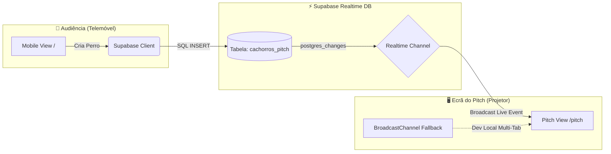

<div align="center">

  # 🌭 SANTA SALSA BROOKLYN
  ### *Interactive Live Pitch & Realtime Street Food Experience*

  [](https://santasalsa.rsoliveira.pt)
  [](https://santasalsa.rsoliveira.pt/pitch)
  [](https://reactjs.org/)
  [](https://www.typescriptlang.org/)
  [](https://tailwindcss.com/)
  [](https://supabase.com)

  *Uma experiência gastronómica interativa em tempo real desenhada para a apresentação de pitch do restaurant venezuelano **Santa Salsa** (Brooklyn, NYC).*

</div>

---

## 🌟 Funcionalidades Principais

### 📱 1. Vista Mobile da Audiência (`/`) — *Build Your Perro*
* **Visualizador Gráfico 3D:** Renderização dinâmica com camadas sobrepostas artesanais (*Pão Brioche, Salsicha Suculenta, Repolho Picado, Queijo Branco Ralado, Batata Palha, Molho de Alho, Molho de Milho Doce e Salsa Rosada*).
* **Medidor "Nível Caracas" (0% a 100%):** Cálculo em tempo real da autenticidade gastronómica.
* **Experiência Interativa:** Efeito tátil de vibração, confetes de celebração e confirmação instantânea do pedido.

### 🖥️ 2. Vista do Projetor / Pitch Wall (`/pitch`) — *Live Menu Board*
* **Mosaico Adaptativo Inteligente (1 a 16+ Perros):** Ajuste automático de grelha (1 a 4 colunas) para apresentar 10 a 16+ pedidos simultaneamente sem scroll.
* **Spotlight do Novo Pedido:** Anel animado a amarelo `#FFEB01`, etiqueta `NOVO!` em fogo e auto-scroll suave para revelar instantaneamente a chegada de cada participante.
* **Código QR Interativo com Ampliação (Zoom 320px):** Código QR incorporado na barra lateral com opção de clique para expansão em modal gigante.
* **Cartões 3D Interativos da História do Restaurante:**
  * **#1 Fundador:** Sergio Leiva com pranchas de skate & cultura de rua.
  * **#2 Brooklyn NYC:** A fachada icónica em Bushwick/Williamsburg.
  * **#3 Perro Real:** A fotografia real do *Perro Caliente* artesanal "Con Todo".

---

## 🏗️ Arquitetura & Sincronização em Tempo Real



---

## ⚡ Configuração Rápida da Base de Dados (Supabase)

Para ativar a sincronização em tempo real na tua instância Supabase, executa o seguinte script no **SQL Editor**:

```sql
-- 1. Criar a tabela de Perros do Pitch
create table if not exists cachorros_pitch (
  id uuid default gen_random_uuid() primary key,
  ingredientes jsonb not null,
  nivel_caracas int not null,
  criado_em timestamp with time zone default timezone('utc'::text, now()) not null
);

-- 2. Configurar políticas de segurança RLS (Row Level Security)
alter table cachorros_pitch enable row level security;

drop policy if exists "Permitir leitura pública" on cachorros_pitch;
create policy "Permitir leitura pública" on cachorros_pitch for select using (true);

drop policy if exists "Permitir inserção pública" on cachorros_pitch;
create policy "Permitir inserção pública" on cachorros_pitch for insert with check (true);

drop policy if exists "Permitir eliminação pública" on cachorros_pitch;
create policy "Permitir eliminação pública" on cachorros_pitch for delete using (true);

-- 3. Ativar publicação Realtime nativa
alter table cachorros_pitch replica identity full;

do $$
begin
  if not exists (
    select 1 from pg_publication_tables 
    where pubname = 'supabase_realtime' and tablename = 'cachorros_pitch'
  ) then
    alter publication supabase_realtime add table cachorros_pitch;
  end if;
end $$;
```

---

## 🛠️ Como Executar Localmente

```bash
# 1. Clonar o repositório
git clone https://github.com/rsoliveira/santa-salsa-pitch.git
cd santa-salsa-pitch

# 2. Instalar dependências
npm install

# 3. Iniciar o servidor de desenvolvimento Vite
npm run dev
```

Acede a:
* 📱 **Mobile View (Audiência):** `http://localhost:5173/`
* 🖥️ **Pitch View (Projetor):** `http://localhost:5173/pitch`

---

## 🎨 Design System & Identidade Visual

| Elemento | Especificação / Hex | Descrição |
| :--- | :--- | :--- |
| **Amarelo Santa Salsa** | `#FFEB01` | Cor oficial da marca (molduras, neon e destaques) |
| **Vermelho Brooklyn** | `#DC2626` / `#991B1B` | Cobertura do cabeçalho do restaurante & botões de ação |
| **Fundo Urbano** | `#0F0F0F` | Dark mode de alto contraste inspirado em cartazes de rua |
| **Tipografia** | `Bebas Neue`, `Outfit`, `Permanent Marker` | Fontes de sinalética vintage, marcador urbano e texto moderno |

---

<div align="center">

  **Santa Salsa Brooklyn** • *Venezuelan Street Food & Interactive Pitch Experience*  
  [https://santasalsa.rsoliveira.pt](https://santasalsa.rsoliveira.pt)

</div>
